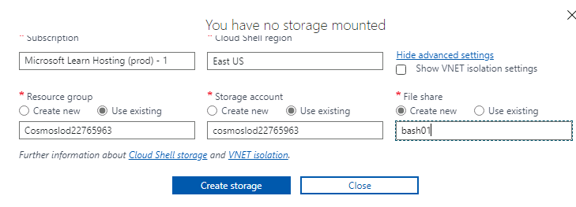
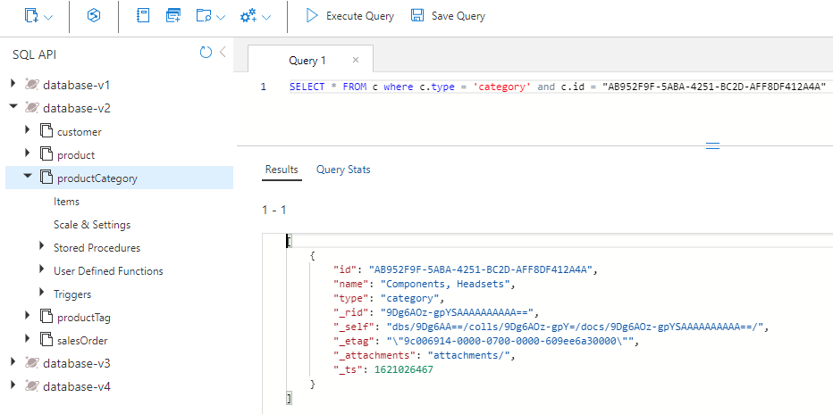
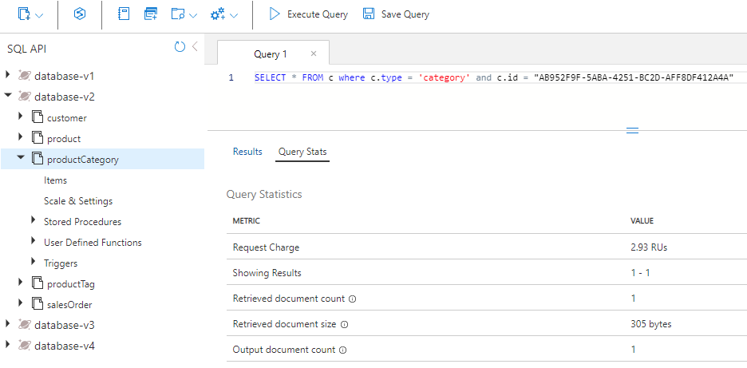
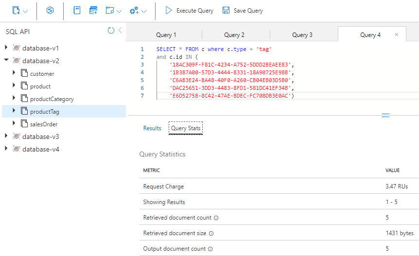
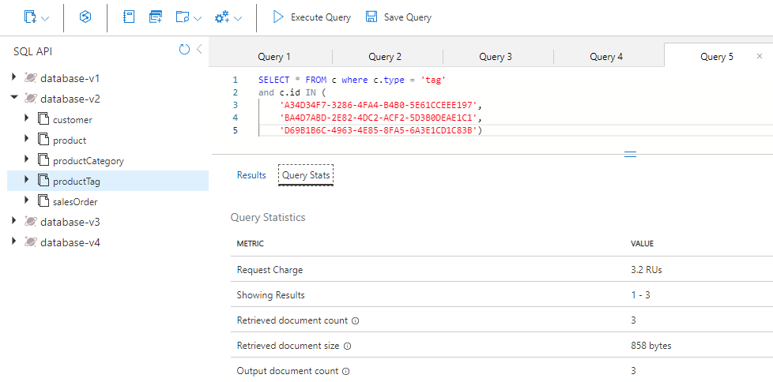
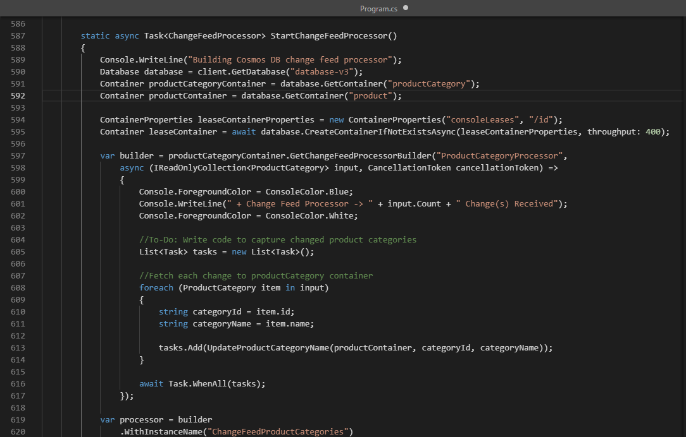
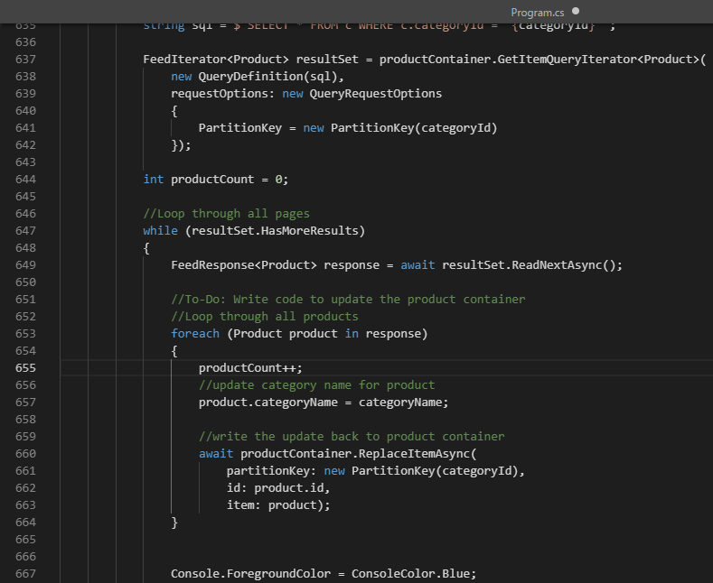
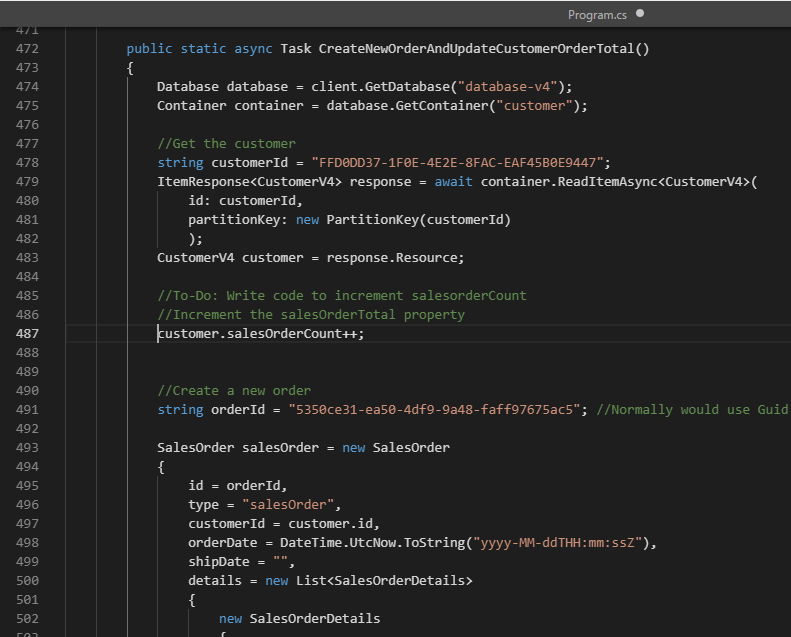

---
lab:
    title: 'Cost of denormalizing data and aggregates and using the change feed for referential integrity'
    module: 'Module 8 - Implement a data modeling and partitioning strategy for Azure Cosmos DB SQL API'
---

# Cost of denormalizing data and aggregates and using the change feed for referential integrity

Using the Relational model could allow us to place different entities in their own containers.  However in NoSQL databases, there are no *joins* between containers so we need to start denormalizing our data to eliminate the use of *joins*. Additionally, NoSQL reduces the number of request by modeling the data so the applications can fetch their data in as fewer requests as possible. One problem that rises when denormalizing our data could be the referential integrity between our entities, for this we can use the change feed to keep the data in sync. Denormalizing your aggregates like group by counts can also help us reduce requests.  

In this lab, you'll look at the benefits of how denormalizing data and aggregates can help us reduce cost and how we can use the change feed to maintain referential integrity on the denormalized data.

## Prepare your Azure Cosmos DB database environment

If you haven't already prepared the Azure Cosmos DB database where you're working on this lab, follow these steps to do so. Otherwise, go to the **Measure performance cost when denormalizing data** section.

1. In a new web browser window or tab, navigate to the Azure portal (``portal.azure.com``).

1. Sign in using your supplied Azure credentials.

1. In this lab, we'll load the sample data using the Azure Cloud Shell terminal, but before we can do that, the Azure Cloud Shell will need an Azure Storage Account added to it to work. If you don't have a storage account already available, we'll need to create one.  If you already have access to your Azure Cloud Shell, you can skip this step.

    1. Select the option to **Create a resource**.

    1. Search for **storage account**.

    1. Select **Storage account** from the list and select **Create**.

    1. Select the correct *subscription* and *resource group* if not already selected.

    1. Using lower case letters and numbers, choose a unique name for your *storage account name*.  If your resource group name is unique enough, you could use that as your *storage account name* too.  Leave all other options to their default values.

        > &#128221; Take note of the ***Region*** you create this storage account in, you will need to choose the same region if setting up the Azure Cloud Shell for the first time below.

   1. Select **Review + Create**, and once the validation passes, choose **Create**.

1. If your Azure Cloud Shell has already been set up, open it up in **Bash** mode, otherwise, use the following instructions to set it up for the first time.

    

    1. Select the **Azure Cloud Shell** button to open it.

    1. Select **Bash** mode.

        
 
    1. Assuming this is the first time you run the Azure Cloud Shell under this Azure account, you'll need to connect an Azure storage account to this Cloud Shell.  Choose **Show advanced settings** to link the storage account. 

        
 
    1. Choose the correct *subscription* and *region*. Under **Resource Group** and **Storage account**, choose **Use existing** and select the correct resource group and storage account.  Under **File share**, give the share a unique name under that storage account. Select **Create storage** to finish setting up the Cloud Shell.

        
 
 1. In the **Azure Cloud Shell Bash terminal**, run the following commands. The commands run a script that creates a new Azure Cosmos DB account, and then build and start the app you use to populate the database and complete the exercises. *The build can take 15-20 minutes to finish, so it might be a good time to get some coffee or tea*.

    ```
    git clone https://github.com/microsoftlearning/dp-420-cosmos-db-dev
    cd dp-420-cosmos-db-dev/17-denormalize
    bash init.sh
    dotnet add package Microsoft.Azure.Cosmos --version 3.22.1
    dotnet build
    dotnet run --load-data

    ```

1. Close the Cloud Shell terminal. **Don't close the Azure Portal**.

1. In the Azure Portal, navigage to the new Azure Cosmos DB Account created by the steps above.

1. Record the **URI** and **Primary Key** under the ***Keys*** section.  We will update the *appSettings.json* file with these values below.

## Prepare your development environment

If you have not already cloned the lab code repository for **DP-420** to the environment where you're working on this lab, follow these steps to do so. Otherwise, open the previously cloned folder in **Visual Studio Code**.

1. Start **Visual Studio Code**.

    > &#128221; If you are not already familiar with the Visual Studio Code interface, review the [Get Started guide for Visual Studio Code][code.visualstudio.com/docs/getstarted]

1. Open the command palette and run **Git: Clone** to clone the ``https://github.com/microsoftlearning/dp-420-cosmos-db-dev`` GitHub repository in a local folder of your choice.

    > &#128161; You can use the **CTRL+SHIFT+P** keyboard shortcut to open the command palette.

1. Once the repository has been cloned, open the local folder you selected in **Visual Studio Code**.

1. In **Visual Studio Code**, open the *appSettings.json* file in the *17-denormalize* folder.

1. Replace *CosmosDBAccountURI* and *CosmosDBAccountKey* with the respective values recorded earlier.

1. Select Ctrl+S to save your changes.

## Exercise 1: Measure performance cost when denormalizing data

### Query for the product category name

In the **database-v2** container, where data is stored in individual containers, run a query to get the product category name, and then view the request charge for that query.

1. If not already opened, in a new web browser window or tab, navigate to the Azure portal (``portal.azure.com``).

1. Sign into the portal using the Microsoft credentials associated with your subscription.

1. On the left pane, select **Azure Cosmos DB**.

1. Select the Azure Cosmos DB account with the name that starts with **cosmicworks**.

1. On the left pane, select **Data Explorer**.

1. Expand **database-v2**.

1. Select the **productCategory** container.

1. At the top of the page, select **New SQL Query**.

1. On the **Query 1** pane, paste the following SQL code, and then select **Execute Query**.

    ```
    SELECT * FROM c where c.type = 'category' and c.id = "AB952F9F-5ABA-4251-BC2D-AFF8DF412A4A"
    ```

1. Select the **Results** tab to review the results. You see that this query returns the name of the product category, "Components, Headsets."

    

1. Select the **Query Stats** tab, and note the request charge of 2.93 RUs (request units).

    

### Query for the products in the category

Next, query the product container to get all the products in the "Components, Headsets" category.

1. Select the **product** container.

1. At the top of the page, select **New SQL Query**.

1. On the **Query 2** pane, paste the following SQL code, and then select **Execute Query**.

    ```
    SELECT * FROM c where c.categoryId = "AB952F9F-5ABA-4251-BC2D-AFF8DF412A4A"
    ```

1. Select the **Results** tab to review the results. You see there are three products returned, HL Headset, LL Headset, and ML Headset. Each product has a SKU, name, price, and an array of product tags.

1. Select the **Query Stats** tab, and note the request charge of 2.9 RUs.

    

### Query for each product's tags

Next, query the productTag container three times, once for each of the three products: HL Headset, LL Headset, and ML Headset.

#### HL headset tags

First, run a query to return the tags for HL Headset.

1. Select the **productTag** container.

1. At the top of the page, select **New SQL Query**.

1. On the **Query 3** pane, paste the following SQL code, and then select **Execute Query**.

    ```
    SELECT * FROM c where c.type = 'tag' and c.id IN ('87BC6842-2CCA-4CD3-994C-33AB101455F4', 'F07885AF-BD6C-4B71-88B1-F04295992176')
    ```

    This query returns the two tags for the HL Headset product.

1. Select the **Query Stats** tab, and note the request charge of 3.06 RUs.

    

#### LL headset tags

Next, run a query to return the tags for LL Headset.

1. Select the **productTag** container.

1. At the top of the page, select **New SQL Query**.

1. On the **Query 4** pane, paste the following SQL code, and then select **Execute Query**.

    ```
    SELECT * FROM c where c.type = 'tag' and c.id IN ('18AC309F-F81C-4234-A752-5DDD2BEAEE83', '1B387A00-57D3-4444-8331-18A90725E98B', 'C6AB3E24-BA48-40F0-A260-CB04EB03D5B0', 'DAC25651-3DD3-4483-8FD1-581DC41EF34B', 'E6D5275B-8C42-47AE-BDEC-FC708DB3E0AC')
    ```

    This query returns the five tags for the LL Headset product.

1. Select the **Query Stats** tab, and note the request charge of 3.47 RUs.

    

#### ML headset tags

Last, run a query to return the tags for ML Headset.

1. Select the **productTag** container.

1. At the top of the page, select **New SQL Query**.

1. On the **Query 5** pane, paste the following SQL code, and then select **Execute Query**.

    ```
    SELECT * FROM c where c.type = 'tag' and c.id IN ('A34D34F7-3286-4FA4-B4B0-5E61CCEEE197', 'BA4D7ABD-2E82-4DC2-ACF2-5D3B0DEAE1C1', 'D69B1B6C-4963-4E85-8FA5-6A3E1CD1C83B')
    ```

    This query returns the three tags for the ML Headset product.

1. Select the **Query Stats** tab, and note the request charge of 3.2 RUs.

    

### Add up the RU charges

Now, let's add up all the RU costs from each of the queries you ran.

| Query | RU cost |
| - | - |
| Category name | 2.93 |
| Product | 2.9 |
| HL product tags | 3.06 |
| LL product tags | 3.47 |
| ML product tags | 3.2 |
| **Total RU cost** | **15.56** |
| | |

### Run the same queries for your NoSQL design

Let's query for the same information but in the denormalized database.

1. In Data Explorer, select **database-v3**.

1. Select the **product** container.

1. At the top of the page, select **New SQL Query**.

1. On the **Query 6** pane, paste the following SQL code, and then select **Execute Query**.

    ```
   SELECT * FROM c where c.categoryId = "AB952F9F-5ABA-4251-BC2D-AFF8DF412A4A"
   ```

    The results will look something like the following:

    

1. Review the data that's returned in this query. It contains all the information you need to render the products for this category, including the category name and tag names for each of the three products.

1. Select the **Query Stats** tab, and note the request charge of 2.9 RUs.

### Compare the performance of the two models

In the relational model, where data is stored in individual containers, you ran five queries to get the name of the category, all the products for that category, and all the product tags for each of the products. The request charge for the five queries totaled 15.56 RUs.

To get the same information in the NoSQL model, you ran one query, and its request charge was 2.9 RUs.

The benefit isn't just the lower cost of a NoSQL design like this model. This type of design is also faster, because it requires only a single request. Further, the data itself is served in the way that it's likely to be rendered on a webpage. This means less code to write and maintain downstream in your e-commerce application.

When you denormalize data, you produce simpler, more efficient queries for your e-commerce application. You can store all the data that's needed by your application in a single container, and you can fetch it with a single query. When you're dealing with high-concurrency queries, this type of data modeling can provide huge benefits in simplicity, speed, and cost.

---

## Exercise 2: Use the change feed to manage referential integrity

In this unit, you'll see how change feed can help maintain referential integrity between two containers in Azure Cosmos DB. In this scenario, you use change feed to listen to the productCategory container. When you update the name of a product category, change feed captures the updated name and updates all the products in that category with the new name.

For this exercise, you'll complete the following steps:

- Complete some C# code to highlight key concepts to understand.
- Start the change feed processor so that it begins to listen to the productCategory container.
- Query the product container for the category whose name you're changing and the number of products in that category.
- Update the category name, and watch change feed propagate the changes to the product container.
- Query the new product container with the new category name, and count the number of products to ensure that they're all updated.
- Change the name back to the original, and watch change feed propagate the changes back.

### Open Visual Studio Code

To go to the code that you'll update for change feed, do the following:

1. If it isn't opened already, open Visual Studio Code, and open the *Program.cs* file in the *17-denormalize* folder.

### Complete the code for change feed

Add code to handle the changes that are passed into the delegate, loop through each product for that category, and update them.

1. Go to the function that starts the change feed processor.

1. Select Ctrl+G, and then type **603** to go to that line in the file.

1. You should now see the following code:

    

   At lines 588 and 589 are two container references. You need to update them with the correct container names. Change feed works by creating an instance of the change feed processor on the container reference. In this case, you're watching for changes to the productCategory container.

1. At line 588, replace **{container to watch}** with **productCategory**.

1. At line 589, replace **{container to update}** with **product**. When a product category name is updated, every product in that category needs to be updated with the new product category name.

1. Below the *container to watch* and *container to update* lines, review the *leaseContainer* line. The leaseContainer works like a checkpoint on the container. It knows what has been updated since the last time it was checked by the change feed processor.
  
   When change feed sees a new change, it calls a delegate and passes the changes in a read-only collection.

1. At line 603, you need to add some code that will be called when change feed has a new change that needs to be processed. To do so, copy the following code snippet and paste it below the line that starts with `//To-Do:`

    ```
    //Fetch each change to productCategory container
    foreach (ProductCategory item in input)
    {
        string categoryId = item.id;
        string categoryName = item.name;
    
        tasks.Add(UpdateProductCategoryName(productContainer, categoryId, categoryName));
    }
    ```

1. Your code should now look like the code in the following image:

    

    By default, change feed runs every second. In scenarios where there are a lot of inserts or updates made in the watched container, the delegate might have more than one change. For this reason, you type the delegate `input` as `IReadOnlyCollection`.

    This code snippet loops through all the changes in the delegate `input` and saves them as strings for `categoryId` and `categoryName`. It then adds a task to the task list with a call to another function that updates the product container with the new category name.

1. Select Ctrl+G, and then enter **647** to find your `UpdateProductCategoryName()` function. Here you write some code that updates each product in the product container with the new category name captured by change feed.

1. Copy the following code snippet and paste it below the line that starts with **//To-Do:**. The function does two things. It first queries the product container for all the products for the passed in `categoryId`. It then updates each product with the new product category name.

    ```
    //Loop through all products
    foreach (Product product in response)
    {
        productCount++;
        //update category name for product
        product.categoryName = categoryName;
    
        //write the update back to product container
        await productContainer.ReplaceItemAsync(
            partitionKey: new PartitionKey(categoryId),
            id: product.id,
            item: product);
    }
    ```

    Your code should now look like this.

    

    The code reads the rows from the response object of the query and then updates the product container with all the products returned by the query.

    You're using a `foreach()` loop to go through each product that's returned by the query. For each row, you update a counter so that you know how many products were updated. You then update the category name for the product to the new `categoryName`. Finally, you call `ReplaceItemAsync()` to update the product back in the product container.

1. Select Ctrl+S to save your changes.

1. If it isn't opened already, open a Git Bash Integrated Terminal and make sure you are under the *17-denormalize* folder.

1. To compile and execute the project, run the following command:

    ```
    dotnet add package Microsoft.Azure.Cosmos --version 3.22.1
    dotnet build
    dotnet run
    ```

1. Your screen should now display the main menu for the application.

    

### Run the change feed sample

Now that you've completed the code for change feed, let's see it in action.

1. On the main menu, select **a** to start the change feed processor. Your screen displays the progress.

    

1. Press any key to return to the main menu.

1. Select **b** on the main menu to update the product category name. The following sequence takes place:

    a. Queries the products container for the "Accessories, Tires, and Tubes" category, and counts how many products are in that category.  
    b. Updates the category name and replaces the word "and" with an ampersand (&).  
    c. Change feed picks up that change and, using the code you wrote, updates all the products for that category.  
    d. Change feed reverts the name change and changes the category name back, replacing "&" with the original "and."  
    e. Change feed picks up that change and updates all the products back to the original product category name.

1. Select **b** on the main menu and follow the prompts until change feed runs a second time, and then hold. The results will look like the following:

    

1. If you clicked too far and went back to the main menu, select **b** again to observe the changes.

---

## Exercise 3: Denormalizing Aggregates

In this unit, you'll see how to denormalize an aggregate to write the top 10 customers query for your e-commerce site. You'll use the transactional batch feature in the Azure Cosmos DB .NET SDK that simultaneously inserts a new sales order and updates the customer's `salesOrderCount` property, both of which are in the same logical partition.

For this exercise, you'll complete the following steps:

- View the code to create a new sales order.
- Complete the C# code to increment *salesOrderCount* for the customer.
- Complete the C# code to implement the transaction to insert the new sales order and update the customer record by using *transactional batch*.
- Run a query for a specific customer to see the customer's record and all of the customer's orders.
- Create a new sales order for that customer and update their `salesOrderCount` property.
- Run your top 10 customers query to see what the results currently are.
- Show how you can use transactional batch when a customer cancels an order.

## Open Visual Studio Code

To get to the code that you'll use in this unit, do the following:

1. If it isn't opened already, open Visual Studio Code, and open the *Program.cs* file in the *17-denormalize* folder.

## Complete the code to update total sales orders

1. Go to the function that creates a new sales order.

1. Select Ctrl+G, and then type **483** to go to that line in the file.

1. You should now see the following code:

    

    This function creates a new sales order and updates the customer record by using transactional batch.

    First, the customer record is retrieved by calling `ReadItemAsync()` and passing in the `customerId` as both the partition key and ID.

1. At line 483, below the `//To-Do:` comment, increment the value of `salesOrderCount` by pasting the following code snippet:

    ```
    //Increment the salesOrderTotal property
    customer.salesOrderCount++;
    ```

    Your screen should now look like this:

    

## Complete the code to implement transactional batch

1. Scroll down a few lines to see the data for the new sales order you'll create for your customer.

    Your new sales order object has a header and detail structure typical of sales orders in an e-commerce application.

    The sales order header has `orderId`, `customerId`, `orderDate`, and `shipDate`, which you'll leave blank.

    Because your customer container contains both customer and sales order entities, your sales order object also contains your discriminator property, `type`, with the value of `salesOrder`. This helps you distinguish a sales order from a customer object in your customer container.

    Farther down, you can also see the two products for the order that make up the details section in your sales order.

1. Scroll a little farther to another `//To-Do:` comment. Here, you need to add code that inserts a new sales order and updates the customer record by using transactional batch.

1. Copy the following code snippet, and then paste it on the line below the `//To-Do:` comment.

    ```
    TransactionalBatchResponse txBatchResponse = await container.CreateTransactionalBatch(
        new PartitionKey(salesOrder.customerId))
        .CreateItem<SalesOrder>(salesOrder)
        .ReplaceItem<CustomerV4>(customer.id, customer)
        .ExecuteAsync();
    
    if (txBatchResponse.IsSuccessStatusCode)
        Console.WriteLine("Order created successfully");
    ```

    This code calls `CreateTransactionalBatch()` on your container object. It takes the partition key value as a required parameter, because all transactions are scoped to a single logical partition. You'll also pass in your new sales order calling `CreateItem()` and your updated customer object calling `ReplaceItem()`. Then, call `ExecuteAsync()` to execute the transaction.

    Finally, check to see whether the transaction was successful by looking at the response object.

    Your screen should now look like the following:

    

1. Select Ctrl+S to save your changes.

1. If it isn't opened already, open a Git Bash Integrated Terminal and make sure you are under the *17-denormalize* folder.

1. To compile and execute the project, run the following command:

    ```
    dotnet build
    dotnet run
    ```

1. Your screen should now display the main menu for the application, as shown here:

    

## Query for the customer and their sales orders

Because you designed your database to store both the customer and all their sales orders in the same container by using `customerId` as your partition key, you can query the customer container and return the customer's record and all of the customer's sales orders in a single operation.

1. On the main menu, select **c** to run the menu item for **Query for customer and all orders**. This query returns the customer record, followed by all the customer's sales orders. You should see all the customer's sales orders output on the screen.

   Note that the last order was for a **Road-650 Red, 58** for $782.99.

1. Scroll up to **Print out customer record and all their orders**.

   Note that the `salesOrderCount` property shows two sales orders.

   Your screen should look like the following:

    

## Create a new sales order and update total sales orders in a transaction

Create a new sales order for the same customer, and update the total sales orders saved in their customer record.

1. Press any key in the window to return to the main menu.

1. Select **d** to run the menu item for **Create new order and update order total**.

1. Press any key to return to the main menu.

1. Select **c** to run the same query again.

   Note that the new sales order shows **HL Mountain Frame - Black, 38** and **Racing Socks, M**.

1. Scroll back up to **Print out customer record and all their orders**.

   Note that the `salesOrderCount` property shows three sales orders.

1. Your screen should look like the following:

    

## Delete an order by using transactional batch

As with any e-commerce application, customers also cancel orders. You can do the same here as well.

1. Press any key to return to the main menu.

1. Select **f** to run the menu item for **Delete order and update order total**.

1. Press any key to return to the main menu.

1. Select **c** to run the same query again to confirm that the customer record is updated.

   Note that the new order is no longer returned. If you scroll up, you can see that `salesOrderCount` value has returned to `2`.

1. Press any key to return to the main menu.

## View the code that deletes a sales order

You delete a sales order in exactly the same way that you create one. Both operations are wrapped in a transaction and executed in the same logical partition. Let's look at the code that does that.

1. Type **x** to exit the application.

1. If it isn't opened already, open Visual Studio Code, and open the *Program.cs* file in the *17-denormalize* folder.

1. Select Ctrl+G, and then enter **529**.

    This function deletes the new sales order and updates the customer record.

    Here you can see that the code first retrieves the customer record and then decrements `salesOrderCount` by 1.

    Next is the call to `CreateTransactionalBatch()`. Again, the logical partition key value is passed in, but this time, `DeleteItem()` is called with the order ID and `ReplaceItem()` is called with the updated customer record.

## View the code for your top 10 customers query

Let's look at the query for your top 10 customers.

1. Select Ctrl+G, and then enter **566**.

    Near the top is the definition for your query.

    ```
    SELECT TOP 10 c.firstName, c.lastName, c.salesOrderCount
        FROM c WHERE c.type = 'customer'
        ORDER BY c.salesOrderCount DESC
    ```

    This query is fairly simple, with a `TOP` statement to limit the number of records returned and an `ORDER BY` on your `salesOrderCount` property in descending order.

    Also notice the discriminator property of `type` with a value of `customer`, so you return only back customers because your customer container has both customers and sales orders within it.

1. To start the application again if it's not already running, run the following command:

    ```
    dotnet run
    ```

1. Finally, type **e** to run the query.

    

    Something you might not realize is that the top 10 customers query is a cross-partition query that fans out across all the partitions in your container.

    The companion lab to this one pointed out that you should strive to avoid cross-partition queries. However, in reality, such queries can be OK in situations where the container is still small or the query is run infrequently. If the query is run frequently or the container is exceptionally large, it would be worth exploring the cost of materializing this data into another container and using it to serve this query.

[code.visualstudio.com/docs/getstarted]: https://code.visualstudio.com/docs/getstarted/tips-and-tricks
